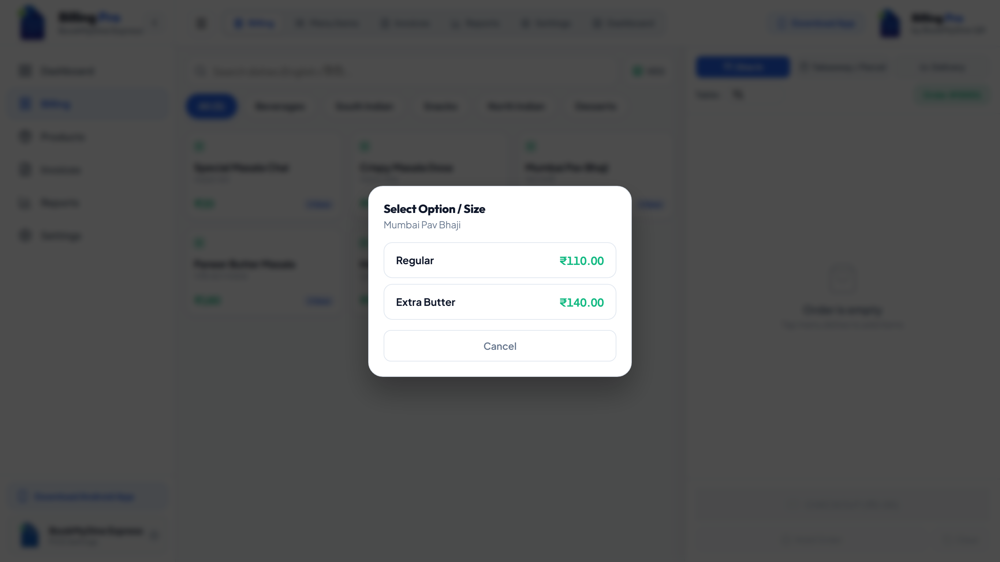
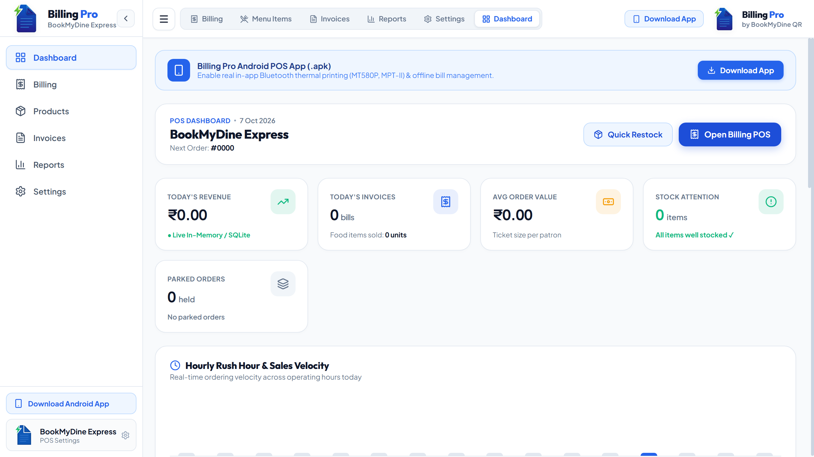
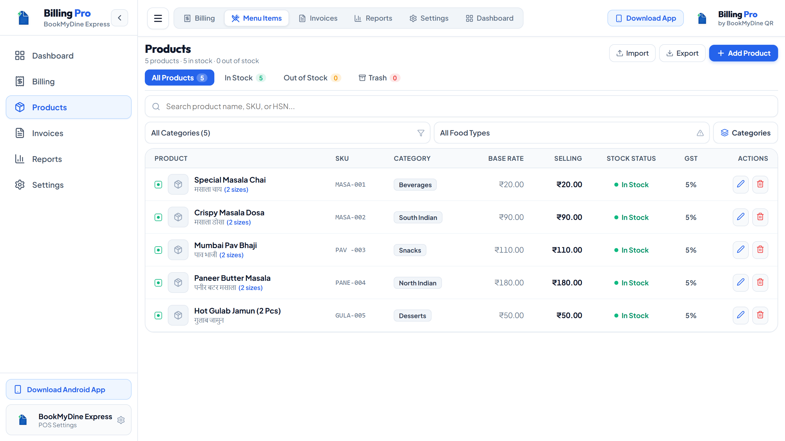
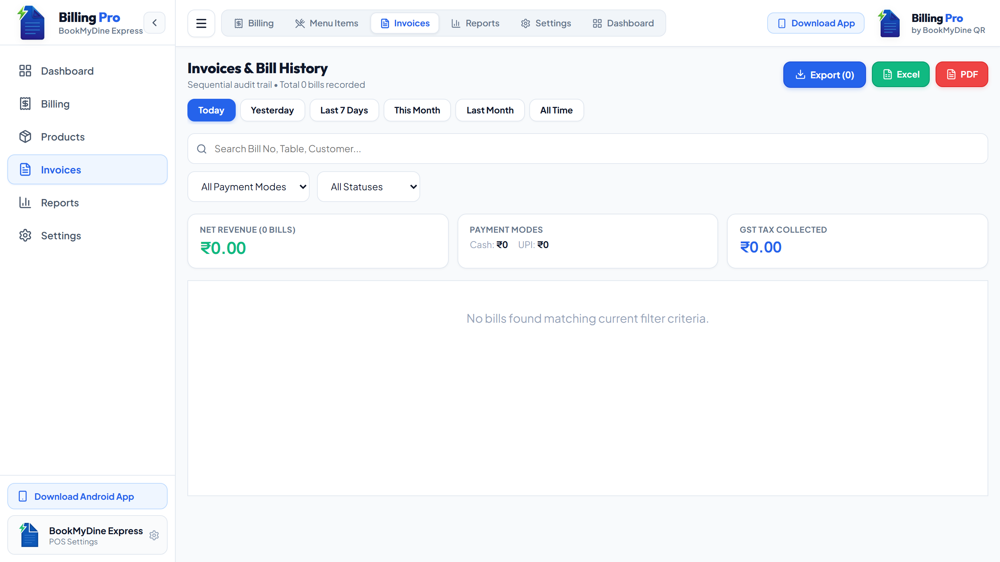
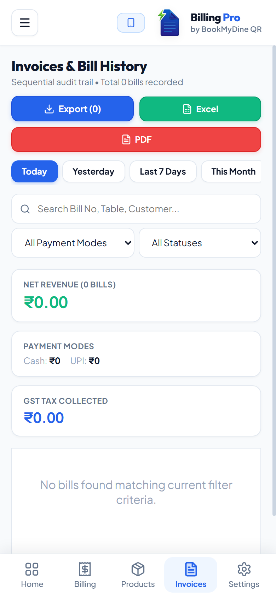

# Billing Pro POS ⚡
### Enterprise Offline-First POS, Thermal Receipt Billing & Business Intelligence Platform

<p align="center">
  
</p>

<p align="center">
  <b>100% Offline Point of Sale (POS) and invoicing powerhouse built for Restaurants, Cafés, QSRs, Cloud Kitchens, Food Trucks, and Retail Counters.</b><br>
  <i>Sub-10 second order punching, native ESC/POS Bluetooth & USB thermal printing, dynamic Bharat UPI QR generation, Dexie IndexedDB offline engine, Google Pay-style settlement animation, and audited financial reporting.</i>
</p>

<p align="center">
  <a href="https://github.com/Tusharjain-19/Billing-Pos/releases"></a>
  <a href="https://github.com/Tusharjain-19/Billing-Pos/releases"></a>
  <a href="https://github.com/Tusharjain-19/Billing-Pos/releases"></a>
  <a href="https://github.com/Tusharjain-19/Billing-Pos/releases"></a>
</p>

<p align="center">
  <a href="https://react.dev/"></a>
  <a href="https://www.typescriptlang.org/"></a>
  <a href="https://electronjs.org/"></a>
  <a href="https://capacitorjs.com/"></a>
  <a href="https://dexie.org/"></a>
  <a href="LEGAL.md"></a>
  <a href="SECURITY.md"></a>
</p>

---

## 📑 Repository Documentation Quick Links

| Document | Purpose & Description |
| :--- | :--- |
| 📖 [**USER_GUIDE.md**](USER_GUIDE.md) | **Step-by-Step Operator Manual**: Cashier workflows, 58mm/80mm Bluetooth printer setup, order holding, dynamic UPI QR settlements, and daily closing procedures. |
| ⚖️ [**LEGAL.md**](LEGAL.md) | **Commercial Licensing & IP Protection**: Commercial terms, ownership rights, anti-reverse engineering restrictions, and liability disclaimers. |
| 🛡️ [**SECURITY.md**](SECURITY.md) | **Security Architecture & Offline Privacy**: Air-gapped database sandboxing, terminal hardening, and zero cloud data leakage guarantees. |

---

## 📥 Direct Download & Release Packages

Download the latest production-ready packages for your device:

| Platform | Package Format | Direct Download Link | Description & Requirements |
| :--- | :--- | :--- | :--- |
| **Windows PC** | **Interactive Setup Wizard (.exe)** | [📥 **Download Billing_Pro_POS_Setup_v1.0.0.exe**](https://github.com/Tusharjain-19/Billing-Pos/releases/download/v1.0.0/Billing_Pro_POS_Setup_v1.0.0.exe) | **Recommended for Windows**: Guided NSIS installer with custom drive/directory selector, desktop shortcut generation, and clean uninstaller. |
| **Windows PC** | **Portable Standalone (.zip)** | [📥 **Download Billing_Pro_POS_v1.0_Windows_x64.zip**](https://github.com/Tusharjain-19/Billing-Pos/releases/download/v1.0.0/Billing_Pro_POS_v1.0_Windows_x64.zip) | **Zero Install**: Extract anywhere (SSD, HDD, or USB flash drive) and launch `Billing-Pro-POS.exe` immediately. |
| **Android Mobile & POS** | **Universal Android Package (.apk)** | [📥 **Download Billing_Pro_v1.0.apk**](https://github.com/Tusharjain-19/Billing-Pos/releases/download/v1.0.0/Billing_Pro_v1.0.apk) | Direct installable APK for Android phones, tablets, and handheld smart POS terminals (Android 7.0+ / API 24+). |
| **Android Play Store** | **Android App Bundle (.aab)** | [📥 **Download Billing_Pro_v1.0.aab**](https://github.com/Tusharjain-19/Billing-Pos/releases/download/v1.0.0/Billing_Pro_v1.0.aab) | Google Play Store distribution binary with optimized split architecture. |

---

## 🎬 Product Demo Video

Watch Billing Pro POS in action — featuring high-speed order punching, instant category navigation, dynamic UPI QR settlement, and thermal receipt printing:

<div align="center">
  <video src="docs/demo/billing_pos_demo.mp4" controls="controls" muted="muted" style="max-width: 100%; border-radius: 14px; border: 1.5px solid #334155; box-shadow: 0 16px 40px rgba(0,0,0,0.35);" width="860">
    <p>Your browser does not support HTML5 video. <a href="docs/demo/billing_pos_demo.mp4">Click here to download and view the demo video</a>.</p>
  </video>
  <br>
  <sub><i>Video: Live demonstration of cashier billing station, order fulfillment, and report generation.</i></sub>
</div>

---

## 📸 Realistic System Screenshots & Business Figures

<div align="center">

### 1. ⚡ High-Speed POS Cashier Billing Station
*Dual-pane cashier station showing real-time menu items (Masala Chai ₹20, Paneer Tikka ₹180, Cold Coffee ₹70), live stock counters (14 left), fulfillment selectors (Dine In / Takeaway / Delivery), custom discount inputs, and active cart docket.*
<br><br>


<br><br>

### 2. 📊 Executive Financial Analytics & Business Intelligence Dashboard
*Visualizing realistic business figures: ₹48,250 gross revenue, 142 daily orders, ₹340 average ticket size, payment mode distribution (Cash 45%, UPI 42%, Card 13%), top selling dishes, and peak sales hours.*
<br><br>


<br><br>

### 3. 🍲 Menu & Inventory Catalog Manager
*Product management catalog with stock indicators, base rates vs selling prices, GST tax slabs (0%, 5%, 12%, 18%), HSN codes, and bulk Excel import/export.*
<br><br>


<br><br>

### 4. 🧾 Invoices, Audit Trail & Bill Revision History
*Comprehensive audit history of settled, held, and cancelled invoices with date range filters, reprint triggers, payment status indicators, and GST compliance logging.*
<br><br>


<br><br>

### 5. 📱 Handheld Mobile POS View (Smartphones & Handheld Terminals)
*Ergonomic mobile layout with bottom navigation tabs, slide-up cart drawer, tactile touch targets, and wireless Bluetooth printer connectivity.*
<br><br>


</div>

---

## 🚀 Key Features & Architectural Highlights

### ⚡ Sub-10-Second High-Speed Billing
- **Tactile Touch Grid**: Designed with large touch targets ($48\text{px}$) for rapid counter punching during high-rush shifts.
- **Bilingual Menu Search**: Instant search indexing across English item names and Hindi transliterations.
- **Order Types**: Seamlessly toggle between **Dine In** (with Table numbers), **Takeaway / Parcel**, and **Delivery**.
- **Inventory Stock Boundaries**: Real-time stock decrement guard prevents selecting or punching more units than available inventory.
- **Held Bills / Parked Orders**: Park active carts with one tap to serve next customers and recall instantly.

### 📴 100% Air-Gapped Offline-First
- **Local Dexie.js (IndexedDB)**: 100% offline database engine with zero server latency and zero cloud dependency.
- **Complete Data Sovereignty**: All business records and customer transactions remain strictly on your local machine.
- **Automated Local Backups**: Generates automated `.json` database snapshots for quick disaster recovery and cross-device migration.

### 🖨️ Native ESC/POS Thermal Printing Engine
- **Bluetooth SPP & USB Direct**: High-speed wireless and wired printing for standard 58mm (2-inch, 384 dots) and 80mm (3-inch, 576 dots) thermal receipt printers.
- **Centered 58mm Logo Rasterization**: Specialized dithering algorithm centers your brand logo and outputs crisp 1-bit monochrome bitmaps without CORS clipping.
- **Itemized Tax & FSSAI Breakdown**: Prints GSTIN, FSSAI registration, itemized CGST/SGST, order fulfillment type, and custom receipt footers.

### 💳 Zero-Fee Dynamic UPI Bharat QR Settlement
- **Instant Client-Side QR Computation**: Generates dynamic UPI payment QR codes on screens and receipts containing merchant VPA and exact payable amount.
- **Zero MDR Fees**: Customers pay directly via PhonePe, Google Pay, Paytm, BHIM, or Cred straight into the merchant's bank account.
- **Google Pay-Style Animated Confirmation**: Displays a celebratory animated green checkmark modal with ripple waves upon bill settlement.

### 📊 Business Intelligence & Financial Dossier Exports
- **10 Indian Restaurant Specific Operational Ratios**: Table turnover velocity, average spend per guest, peak revenue hours, and food cost metrics.
- **Real Graphs in PDF Export**: Automatically embeds visual daily revenue charts, payment mode distribution donuts, and dish velocity graphs into exported PDF audit files.
- **Excel & PDF Exports**: One-click generation of `.xlsx` spreadsheets and formatted PDF audit summaries for accounts and CA tax filings.

---

## 🛠️ Technology Stack

| Layer | Technology | Version | Purpose |
| :--- | :--- | :--- | :--- |
| **Frontend Framework** | **React** | `19.2` | High-efficiency UI component architecture & fast state reconciliation |
| **Language** | **TypeScript** | `5.8` | End-to-end type safety across POS models, database transactions, and print drivers |
| **Build Pipeline** | **Vite** | `6.2` | Lightning-fast build bundling and Hot Module Replacement |
| **Desktop Shell** | **Electron** | `44.6` | 100% offline native desktop container with local file system & printer bridge |
| **Windows Packaging** | **NSIS / Electron Builder** | `26.15` | Multi-step interactive Windows installer with license consent & location picker |
| **Mobile Runtime** | **Capacitor JS** | `8.5` | Native Android bridge for Bluetooth SPP, Haptics & Filesystem |
| **Database Engine** | **Dexie.js** | `4.4` | High-performance IndexedDB engine for offline storage |
| **Spreadsheets** | **SheetJS (XLSX)** | `0.18` | In-browser Excel `.xlsx` report generator & menu importer |
| **Document Engine** | **jsPDF & AutoTable** | `4.2` | High-definition PDF invoice & settlement audit report generator |
| **Iconography** | **Lucide Icons** | `1.49` | Clean, high-legibility interface iconography |

---

## 💻 Developer Guide & Local Build

### 1. Clone & Install Dependencies
```bash
git clone https://github.com/Tusharjain-19/Billing-Pos.git
cd Billing-Pos
npm install
```

### 2. Run Local Web Dev Server
```bash
npm run dev
```
Open [http://localhost:5173](http://localhost:5173) in your browser.

### 3. Build Production Web Bundle
```bash
npm run build
```

### 4. Build Windows Desktop Setup Installer (.exe)
```bash
npm run dist:exe
```
Generates `release-pc/Billing_Pro_POS_Setup_v1.0.0.exe` with interactive NSIS installer.

### 5. Build Android Release APK & AAB
```powershell
npm run cap:sync
cd mobile/android
./gradlew assembleRelease bundleRelease
```

---

## ⚖️ Legal & Copyright Notice

Copyright © 2026 **Billing Pro POS / BookMyDine QR**. All Rights Reserved Worldwide.  
This software and its compiled binaries are proprietary commercial products. For complete licensing terms, restrictions, and data protection policies, please refer to [**LEGAL.md**](LEGAL.md) and [**SECURITY.md**](SECURITY.md).

---

<p align="center">
  <b>Billing Pro POS</b> • Superfast • Reliable • 100% Offline • High Performance Point of Sale System
</p>
